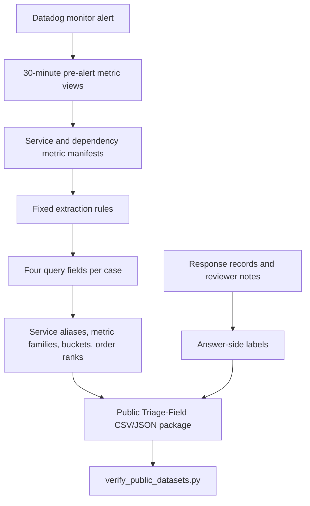
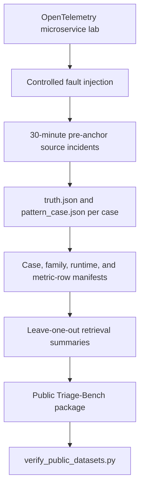

# Metric-Pattern Incident Memory Public Data Package

This folder is a public data package for the data used by the
Metric-Pattern Incident Memory paper. It contains abstracted Samsung Account
field evidence and a controlled OpenTelemetry fault benchmark.

The package separates two dataset scopes. Triage-Field provides release
aliases, metric-family buckets, reviewed labels, and retrieval outcomes for
the abstracted field cases. Triage-Bench provides the fixed controlled
benchmark source incident set, including benchmark timestamp/value rows,
source manifests, plots, and leave-one-out retrieval summaries.

## Contents

```text
datasets/
  triage-field/
    README.md
    data/
      cases.csv
      query_fields.csv
      labels.csv
      retrieval_results.csv
      family_distribution.csv
      aggregate_results.csv
      service_alias_inventory.csv
      manifest.json
    samples/
      datadog_metric_manifest.redacted.sample.csv
      datadog_change_manifest.redacted.sample.csv
  triage-bench/
    README.md
    data/
      ablation_results.csv
      case_ids_200.json
      summary_200.json
      leave_one_out_all_200.json
      prior_same_family_200.json
      report.md
    source/
      README.md
      case_manifest_200.csv
      fault_family_manifest.csv
      metric_signal_rows.csv
      runtime_profile_summary.csv
      window_duration_summary.csv
      incidents/
        <case_id>/
          README.md
          truth/truth.json
          pattern/pattern_case.json
          pattern/rag_pattern.json
          raw/metrics_long.csv
          plots/
            snapshot_overview.png
            incident_metric_panels.png
  paper_numbers.json
scripts/
  README.md
  build_triage_bench_source_release.py
  verify_public_datasets.py
  make_manifest.py
paper-tables/
  README.md
  table-iii-label-retriever-check/
    base/
    scripts/
  table-iv-triage-field-cumulative/
    base/
    scripts/
  table-v-triage-bench-cumulative/
    base/
    scripts/
MANIFEST.sha256
```

## Dataset Roles

`triage-field` is the public package for Triage-Field, the abstracted
30-case Samsung Account field set used by the paper. Each case has one alert
time, one 30-minute pre-alert metric window, four public query fields,
answer-side labels, and a self-excluded retrieval outcome.

`triage-bench` is the public package for Triage-Bench, the controlled
200-case OpenTelemetry fault benchmark used for repeatability and cumulative
field-addition comparison.

## Data Lineage

Triage-Field begins from Samsung Account alert response work. The release
contains abstracted review fields used by the paper and redacted manifest
samples showing the Datadog metric inventory format summarized before release.



Triage-Bench is generated in a controlled environment, so the public package
includes the fixed source incident set in addition to the paper summary
files. Each case keeps its `truth.json`, compact `rag_pattern.json`, and
`pattern_case.json` extracted from the 30-minute pre-anchor window.



## What Can Be Checked

The package supports checking:

- Triage-Field case count, family count, recurring/singleton structure, labels, and
  self-excluded retrieval outcomes.
- Triage-Field paper results: alert-message-only `6/30` first-service,
  four-field `24/30` first-service, and `23/30` family.
- Triage-Bench source incident-set completeness: 200 case directories, 600
  per-case source JSON files, and 200 raw metric CSV files.
- Triage-Bench per-case READMEs and exactly two generated PNG plots under each
  `source/incidents/<case_id>/` directory.
- Triage-Bench case/family manifests, runtime-profile availability, duration
  distribution, and metric signal rows extracted from the source incidents.
- Triage-Bench paper results: alert-message-only `61/200` service-metric
  and four-field `153/200` service-metric.
- Triage-Bench tied-record reduction from `13.19` to `1.04`.

The released files support package checks, table-number checks, and
source-layout checks for the paper data.

## Verification

Run from this directory:

```bash
python3 scripts/verify_public_datasets.py
```

Expected output:

```text
OK: public dataset checks passed
```

To create a checksum manifest:

```bash
python3 scripts/make_manifest.py > MANIFEST.sha256
```

To rebuild the Triage-Bench source manifests from the included source incidents:

```bash
python3 scripts/build_triage_bench_source_release.py
```

Maintainers can refresh the included Triage-Bench source incidents from a
workspace source copy:

```bash
python3 scripts/build_triage_bench_source_release.py \
  --input /path/to/triage-bench-source/incidents \
  --copy-incidents
```

To rebuild the paper table rows used by `draft/i10p/candidate/main.tex`:

```bash
python3 paper-tables/scripts/verify_all_paper_tables.py
python3 paper-tables/table-iii-label-retriever-check/scripts/build_table_iii_label_retriever_check.py --check-tex
python3 paper-tables/table-iv-triage-field-cumulative/scripts/build_table_iv_triage_field_cumulative.py --check-tex
python3 paper-tables/table-v-triage-bench-cumulative/scripts/build_table_v_triage_bench_cumulative.py --check-tex
```

`paper-tables/scripts/verify_all_paper_tables.py` checks all tables in the
candidate paper. Tables I--II are static example/definition tables and are
checked against the TeX; Tables III--V are rebuilt from table-specific base
files and checked against the TeX. The `paper-tables/` directory is included as
optional check material for the submitted tables and is separate from the public
dataset verification path.

## Rebuild Scope

The package separates these workflows:

1. Public verification: anyone with this repository can run
   `scripts/verify_public_datasets.py` to check the released data package and
   paper numbers.
2. Triage-Bench rebuild: anyone with this repository can regenerate the
   Triage-Bench source manifests, per-case READMEs, and generated overview
   plots from the included source incidents. Regenerating PNG plots requires
   `matplotlib`.
3. Paper-table check: authors can rebuild the submitted Table III--V rows from
   `paper-tables/` and check them against `draft/i10p/candidate/main.tex`.
4. Triage-Field rebuild: maintainers regenerate the abstracted field package
   from review inputs kept in the internal preparation workflow.

## Release Identifiers

Stable public identifiers such as `O01`, `F01`, and `S01` are release aliases.
The package uses aliases, metric-family labels, buckets, and row-level
manifests to keep the released files consistent across scripts and tables.

## License

This package uses a split license. Triage-Field data and field-derived
artifacts are licensed under CC BY-NC-ND 4.0. Triage-Bench data and bench-only
artifacts are licensed under CC BY-ND 4.0. Verification and reproduction
scripts are licensed under MIT. See `LICENSE`, `LICENSE-CC-BY-NC-ND-4.0`,
`LICENSE-CC-BY-ND-4.0`, and `LICENSE-MIT`.

Artifacts that combine Triage-Field and Triage-Bench material, and
repository-level documentation that describes both release boundaries, are
licensed under CC BY-NC-ND 4.0 unless a more specific notice is provided.
