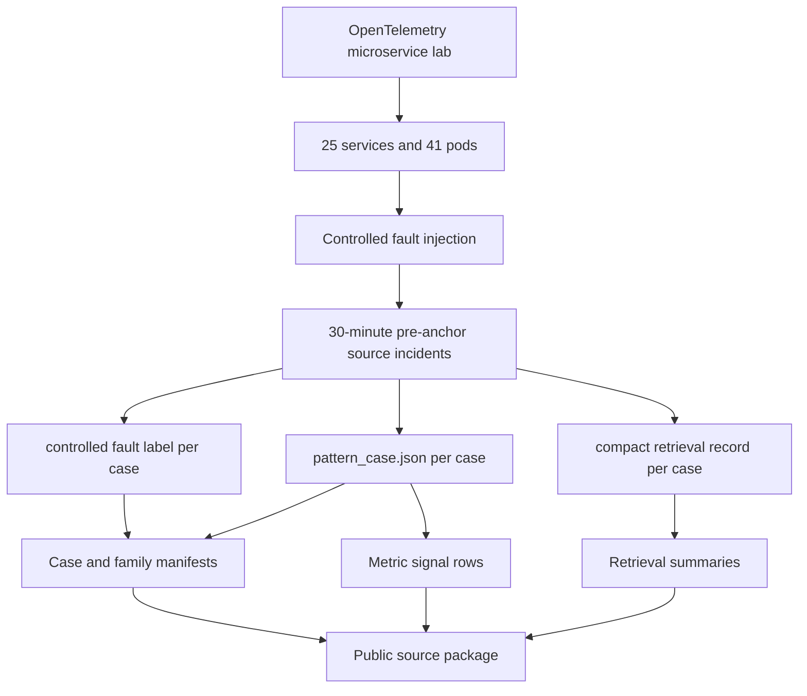

# Triage-Bench Dataset

This dataset is the public data package for the controlled 200-case
OpenTelemetry fault benchmark used in the paper. It is a repeatability and
cumulative field-addition dataset.

## Files

| File | Purpose |
| --- | --- |
| `data/ablation_results.csv` | Paper ablation table. |
| `data/case_ids_200.json` | Fixed case IDs. |
| `data/summary_200.json` | Dataset counts, family distribution, and summary metrics. |
| `data/leave_one_out_all_200.json` | Leave-one-out metrics for all 200 cases. |
| `data/prior_same_family_200.json` | Metrics for the 177 cases with at least one prior same-family memory. |
| `data/report.md` | Human-readable benchmark report. |
| `source/incidents/` | Case directories with README, source JSON files, and colocated plots for each case. |
| `source/case_manifest_200.csv` | One row per case extracted from the source incidents. |
| `source/fault_family_manifest.csv` | Fault family, controlled fault label, case group, and actuator summary. |
| `source/four_field_records.csv` | Auxiliary source four-field record rows. |
| `source/raw_metric_manifest.csv` | Auxiliary raw metric row-count manifest for the released benchmark CSVs. |
| `source/metric_signal_rows.csv` | Service-metric rows extracted from each `pattern_case.json`. |
| `source/runtime_profile_summary.csv` | Runtime profile snapshot summary for the 25 instrumented services. |
| `source/window_duration_summary.csv` | Window, duration, execution, and provenance counts. |

## Key Properties

- Cases: `200`
- Services: `25`
- Pods: `41`
- Fault families: `23`
- Cases with prior same-family memory: `177`
- Window: `anchor-30m to anchor`

## Dataset Role

Triage-Bench complements Triage-Field. Triage-Field is Samsung Account field
evidence. Triage-Bench is a controlled check that the same four-field record
design narrows service-metric candidates when metric windows and labels are
fully observable.

## Construction Lineage

The benchmark is built from an OpenTelemetry-instrumented microservice lab
environment with controlled fault injection. The public package includes the
fixed source snapshot used to create the paper summaries.



Fault families cover latency, error spikes, pod restarts, resource saturation,
queue backlog, datastore slowdown, and dependency response degradation.
Several major stateless services are run with multiple replicas so that pod
failure and resource pressure appear as partial degradation and downstream
symptoms in the metric window.

Each case uses the metric window from `anchor-30m` to `anchor`. Post-anchor
telemetry can exist in the live benchmark artifacts because the campaign also
records fault and recovery context. Retrieval uses the pre-anchor window to
match the alert-time incident triage task.

The source package has 200 case directories under `source/incidents/`. Each
directory contains:

```text
truth/truth.json
pattern/pattern_case.json
pattern/rag_pattern.json
raw/metrics_long.csv
plots/snapshot_overview.png
plots/incident_metric_panels.png
```

`truth.json` stores the controlled fault label. `metrics_long.csv` stores the
released timestamp/value rows for the case. `pattern_case.json` stores the
pre-anchor dominant signal, earliest change, ordered service-metric changes,
metric rows, runtime profile, load profile, and injection detail when that
provenance is available. `rag_pattern.json` stores the compact serialized
pattern used by retrieval experiments. Some `pattern_case.json` files contain
`NaN` markers because they are copied from the Python-generated source
case files; the verification script reads them with Python's standard JSON
parser.

The source files use benchmark-format field names for controlled fault labels.

This source package includes released benchmark timestamp/value rows and
per-case plots, so its size is dominated by raw CSV and PNG files. The paper
evaluates the fixed 200-case source incident set.

## Per-Case Visual Views

Each case directory contains its own `README.md` and exactly two PNG
plots in the `plots/` subdirectory. Both plots are generated directly from
that case's released `pattern_case.json`, so the visual layout is uniform
across all 200 cases. `snapshot_overview.png` summarizes the top
service-metric changes, earliest abnormal offsets, anomaly strength, and case
metadata. `incident_metric_panels.png` shows the same case as compact metric
panels for magnitude, timing, and rank-score inspection:

```text
source/incidents/<case_id>/
  README.md
  truth/truth.json
  pattern/pattern_case.json
  pattern/rag_pattern.json
  raw/metrics_long.csv
  plots/
    snapshot_overview.png
    incident_metric_panels.png
```

The visual check view is colocated with the case it explains.

## Case Set

The released benchmark fixes 200 cases covering 23 predefined fault families,
including repeated-family and mixed-symptom cases needed to evaluate
leave-one-out retrieval. Of the 200 cases, 177 have at least one prior
same-family memory.

## Source Manifest Rebuild

The primary source manifests are generated from the included source incidents:

```bash
python3 scripts/build_triage_bench_source_release.py
```

Maintainers can refresh the source incidents from the workspace copy:

```bash
python3 scripts/build_triage_bench_source_release.py \
  --input /path/to/triage-bench-source/incidents \
  --copy-incidents
```

The rebuild checks that all 200 fixed case IDs exist, writes
`case_manifest_200.csv`, `fault_family_manifest.csv`,
`metric_signal_rows.csv`, `runtime_profile_summary.csv`, and
`window_duration_summary.csv`, and regenerates per-case README files and both
PNG plots. Regenerating PNG plots requires `matplotlib`. Auxiliary source CSVs
such as `four_field_records.csv` and `raw_metric_manifest.csv` are included as
source check files.

## Paper Results

| View | Input condition | First-service@1 | Service-metric@1 | Tied rec. |
| --- | --- | ---: | ---: | ---: |
| All 200 | Alert message only | 71/200 | 61/200 | 13.19 |
| All 200 | Maximum change | 155/200 | 146/200 | 12.38 |
| All 200 | Earliest abnormal | 159/200 | 149/200 | 8.02 |
| All 200 | Four-field with order | 155/200 | 153/200 | 1.04 |
| Prior-family 177 | Four-field with order | 143/177 | 141/177 | |

## Interpretation

Triage-Bench checks whether the same four-field representation narrows
service-metric candidates under controlled labels. It complements the
Triage-Field field evidence.

## License

Triage-Bench data and bench-only artifacts are licensed under CC BY-ND 4.0. See
`../../LICENSE-CC-BY-ND-4.0` and the repository-level `LICENSE`.

## Verification

Run from the public package root:

```bash
python3 scripts/verify_public_datasets.py
```

Expected output:

```text
OK: public dataset checks passed
```
