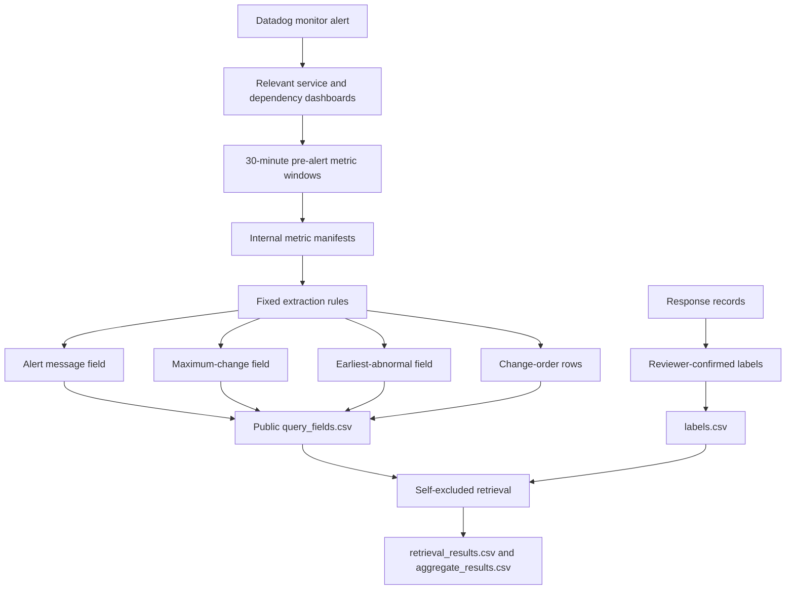

# Triage-Field

This directory contains the public package for Triage-Field, the abstracted
30-case Samsung Account field set used by the paper.

Triage-Field is an abstracted Samsung Account field-evidence dataset. It is designed
to support paper-result checks with release aliases, metric-family buckets,
and reviewed labels. A Triage-Field case is the released review unit with one
alert time, one 30-minute pre-alert metric window, and one reviewer-confirmed
first-service target. Duplicate notifications, recovery messages, and
follow-up monitor events from the same response episode are grouped under the
same released case when they share the same alert time, service-metric path,
and first-service target.

## Files

| File | Purpose |
| --- | --- |
| `data/cases.csv` | Public case IDs, public family IDs, alert-service aliases, and reviewed first-service labels. |
| `data/query_fields.csv` | Four alert-time fields: alert message, maximum change, earliest abnormal, and change order. |
| `data/labels.csv` | Reviewed labels and SRE agreement flags. Labels are excluded from the query. |
| `data/retrieval_results.csv` | Self-excluded four-field retrieval outcomes. |
| `data/family_distribution.csv` | Public family size and hit counts. |
| `data/aggregate_results.csv` | Paper aggregate results used by the paper. |
| `data/service_alias_inventory.csv` | Public service aliases and broad service layer labels. |
| `data/manifest.json` | Release transformation summary. |
| `samples/datadog_metric_manifest.redacted.sample.csv` | Redacted source-format sample showing the kind of Datadog metric manifest summarized before release. |
| `samples/datadog_change_manifest.redacted.sample.csv` | Redacted source-format sample showing how raw query-bearing metric rows are reduced to public metric-family information. |

## Key Properties

- Cases: `30`
- Public reviewed families: `8`
- Recurring families: `5`
- Singleton families: `3`
- Query field rows: `240`
- Retrieval protocol: queried incident excluded from searchable memory

## Triage-Field Case Scope

Triage-Field is an owner-scoped reviewable evaluation set. A case enters the
released set when the predefined review unit is present: alert time,
30-minute pre-alert metric window, and reviewer-confirmed first-service target.

The paper uses these units:

| Unit | Meaning |
| --- | --- |
| Raw notification | A monitor event, recovery message, or follow-up signal. |
| Triage-Field case | One abstracted case with one alert time, one 30-minute pre-alert metric window, public query fields, and answer-side labels. |
| Incident family | Reviewed group of cases whose early service-metric pattern can be reused as incident memory. |
| First-service target | The service whose dashboard should be checked first in the reviewed response sequence. |

The set includes recurring families because retrieval requires prior memory,
and it retains singleton families to expose cold-start limits.

## Source-to-Public Lineage

The Samsung Account source material begins from Datadog monitor alerts and
dashboard-derived metric views. The released files contain the review fields
derived from those views and small redacted manifest samples showing the
collection shape.



The internal Datadog collection uses service and dependency views around the
alert time. The release keeps service aliases, layer labels, metric families,
direction buckets, magnitude buckets, relative offset buckets, and order ranks.
The source-format samples in `samples/` show the pre-release manifest shape.

Representative query shapes look like the following generic forms.

```text
avg:<service_latency_metric>{service:<service>,env:<env>,region:<region>}.rollup(avg, 60)
sum:<request_or_error_metric>{service:<service>,env:<env>,region:<region>}.as_count().rollup(sum, 60)
max:<resource_metric>{service:<service>,cluster:<cluster>,namespace:<namespace>}.rollup(max, 60)
avg:<dependency_metric>{dependency:<dependency>,env:<env>,region:<region>}.rollup(avg, 60)
```

The collection covers metric families. The
families include service health, request/error counts, latency, pod/runtime
signals, capacity/resource signals, network/process signals, dependency
signals, and datastore or storage-related signals. The released package keeps
only the public service alias, broad service layer, metric family, direction,
magnitude bucket, relative offset bucket, and order rank.

## Transformation Rules

The public query fields are generated before retrieval. Answer-side labels,
family labels, mitigation text, and response-summary fields are stored
separately from query fields.

| Public field | Source relation | Released expression |
| --- | --- | --- |
| `alert_message` | Monitoring service-metric named by the alert | Service alias, layer, metric family, alert marker |
| `maximum_change` | Largest baseline-normalized movement in the 30-minute pre-alert window | Service alias, metric family, direction, magnitude bucket |
| `earliest_abnormal` | First service-metric entering the abnormal range | Service alias, metric family, direction, relative offset bucket |
| `change_order` | First abnormal service-metric pairs in time order | Order rank, service alias, metric family, relative offset bucket |

The release keeps bucket labels for thresholds, baselines, offsets, and metric
values. This preserves the service-metric relation used by the paper tables.

## Rebuild and Verification

Anyone with this public package can verify the released counts and paper
numbers:

```bash
cd ../../
python3 scripts/verify_public_datasets.py
```

Expected output:

```text
OK: public dataset checks passed
```

Triage-Field is rebuilt internally from review inputs. The public package
supports verification of the released package and paper numbers.

## Paper Results

| Input condition | Family@1 | First-service@1 | Avg. first-service candidates |
| --- | ---: | ---: | ---: |
| Alert message only | 9/30 | 6/30 | 2.97 |
| + maximum change | 18/30 | 19/30 | 1.20 |
| + earliest abnormal | 19/30 | 20/30 | 1.00 |
| Four-field with order | 23/30 | 24/30 | 1.00 |

## Release Fields

Reduced before release:

- actual service names,
- actual incident IDs,
- exact timestamps,
- region and preset,
- exact offset minutes,
- production metric values,
- raw Datadog queries and tags,
- dashboard/widget IDs,
- owner/person identifiers.

Preserved in the release:

- public case/family/service aliases,
- broad service layer,
- metric family,
- direction and magnitude bucket,
- relative offset bucket,
- order rank,
- reviewed first-service label,
- self-excluded retrieval outcome.

## Scope

This dataset supports the paper task of checking whether an abstract
incident-memory record narrows alert-time first inspection targets.

## License

Triage-Field data and field-derived artifacts are licensed under CC BY-NC-ND
4.0. See `../../LICENSE-CC-BY-NC-ND-4.0` and the repository-level `LICENSE`.
